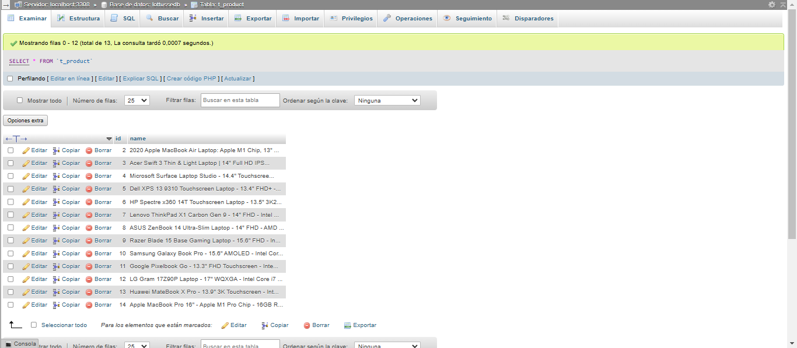

# Lottusse Backend

Este proyecto es el backend para la aplicación Lottusse. Proporciona una API RESTful para gestionar las operaciones de la aplicación, incluyendo la gestión de productos. Permite agregar productos, revisar si hay productos existentes en Redis o en la Base de Datos y devolver todos los productos o por su ID en formato JSON.

## Requisitos

Antes de comenzar, asegúrate de tener instalados los siguientes requisitos:

- Java 17
- Maven
- MySQL
- Redis

## Instalación

Sigue estos pasos para instalar y configurar el proyecto:

1. Clona el repositorio:

    ```bash
    git clone https://github.com/Melendref14/pruebas-tecnicas-lottusse.git
    ```

2. Navega al directorio del proyecto:

    ```bash
    cd lottusse-backend
    ```

3. Configura las propiedades de la aplicación:

    Edita los archivos de propiedades en `src/main/resources` para configurar las conexiones a MySQL y Redis según tu entorno:

    - `application-local.properties`
    - `application-staging.properties`
    - `application-production.properties`

4. Crea la base de datos y las tablas necesarias:

    Ejecuta el script `setup.sql` en tu servidor MySQL para crear la base de datos y las tablas, y para insertar productos de ejemplo:

    ```bash
    mysql -u tu-usuario -p < path/to/setup.sql
    ```

## Estructura de la Base de Datos

A continuación se muestra una imagen de cómo debería verse la estructura de la base de datos:



5. Compila y ejecuta la aplicación:

    ```bash
    ./mvnw spring-boot:run
    ```

    La aplicación debería estar corriendo en `http://localhost:8080`.

## Uso

La aplicación proporciona la siguiente funcionalidad:

### Listado de Productos

- **URL:** `/products`
- **Descripción:** Muestra un listado de los productos obtenidos desde la API del backend.

## Estructura del Proyecto

La estructura del proyecto es la siguiente:

```
lottusse-backend/
├── src/
│   ├── main/
│   │   ├── java/
│   │   │   └── com/
│   │   │       └── example/
│   │   │           └── lottusse_backend/
│   │   │               ├── config/
│   │   │               ├── controller/
│   │   │               ├── entity/
│   │   │               ├── repository/
│   │   │               ├── service/
│   │   │               └── LottuseBackendApplication.java
│   │   └── resources/
│   │       ├── static/
│   │       ├── templates/
│   │       ├── application-production.properties
│   │       ├── application-local.properties
│   │       ├── application-staging.properties
│   │       ├── application.properties
│   └── test/
│       └── java/
│           └── com/
│               └── example/
│                   └── lottusse_backend/
│                       └── LottuseBackendApplicationTests.java
├── .gitignore
├── mvnw
├── mvnw.cmd
├── pom.xml
└── README.md
```

Esta estructura sigue las convenciones estándar de un proyecto Spring Boot, con directorios separados para controladores, modelos, repositorios y servicios.