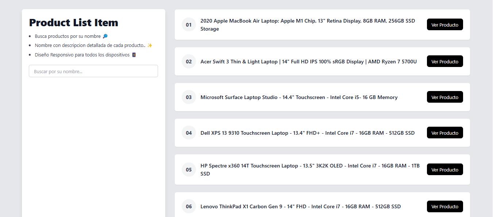

# Lottusse Frontend

Este proyecto es la parte frontend de la aplicación Lottusse. Aquí encontrarás toda la información necesaria para entender, instalar y ejecutar el proyecto.



## Requisitos

Antes de comenzar, asegúrate de tener instalados los siguientes programas:

- Node.js (versión 14 o superior)
- npm (versión 6 o superior)

## Instalación

Sigue estos pasos para instalar el proyecto:

1. Clona el repositorio:
    ```bash
    git clone https://github.com/Melendref14/pruebas-tecnicas-lottusse.git
    ```
2. Navega al directorio del proyecto:
    ```bash
    cd lottusse-frontend
    ```
3. Instala las dependencias:
    ```bash
    npm install
    ```
4. Crear .env para realizar peticiones al backend:
```bash
NEXT_PUBLIC_API_URL=http://localhost:8080/api
```

## Ejecución

Para ejecutar el proyecto en un entorno de desarrollo, utiliza el siguiente comando:
```bash
npm run dev
```
Esto iniciará la aplicación en `http://localhost:3000`.

## Scripts Disponibles

En el proyecto, puedes ejecutar los siguientes scripts:

- `npm run dev`: Inicia la aplicación en modo desarrollo.
- `npm run build`: Construye la aplicación para producción en la carpeta `build`.
- `npm test`: Ejecuta las pruebas.

## Estructura del Proyecto

La estructura del proyecto es la siguiente:

```
lottusse-frontend/
├── public/
├── app/
│   ├── assets/
│   ├── components/
│   ├── hooks/
│   ├── globals.css/
│   ├── layout.js
│   ├── page.js
├── package.json
└── README.md
```

